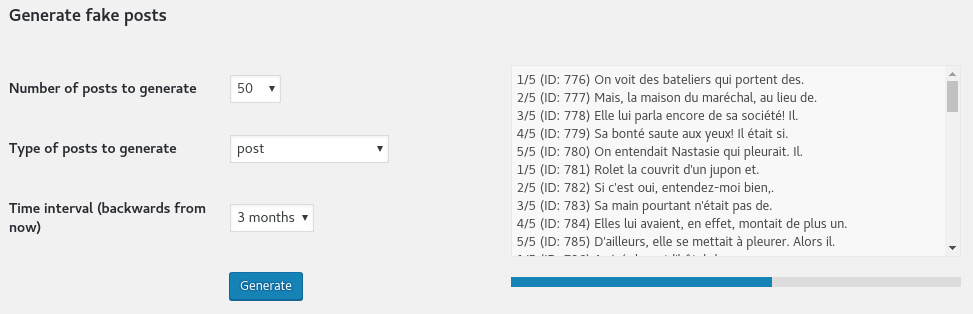
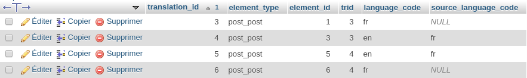

# Fake Real Text plugin for WordPress

- Contributors: me (Benoît Hubert)
- Site URL: https://developpeur-web-toulouse.fr/

This plugin generates content (posts, comments, categories, tags) in order to populate a WordPress site. It generates
"real" text, not lorem ipsum.

## Description

The motivation for this plugin was to create a large amount of content, in order to test my React-based WordPress theme
(which is still in progress).

I gave [FakerPress](https://wordpress.org/plugins/fakerpress/) a try, and though it's really nice, it uses lorem ipsum,
and doesn't handle multilingual content.

Since I will use this theme for a WPML-powered multilingual site, I wanted to generate posts in all active languages,
not only the blog's main language.

## Credits

WordPress, and web development in general, have a great community of people sharing their awesome work. Thank them all!
Here are the tools that helped me get started fast.
- [WordPress Plugin Boilerplate Generator](https://wppb.me/) by [Tom McFarlin](https://tommcfarlin.com/) and
[Devin Vinson](https://twitter.com/DevinVinson)
- [Faker](https://github.com/fzaninotto/Faker) by [Francois Zaninotto](https://marmelab.com/fr/)
- [WPML](https://wpml.org/), a great multilingual plugin
- [Responsive Grid Generator](http://www.responsivegridsystem.com/calculator/) by
[Graham Miller](https://www.edwardrobertson.co.uk/who-we-are)
- [Super Simple Progress Bar](https://codepen.io/thathurtabit/pen/ymECf) by [Stephen Fairbanks](http://ghosthorses.co.uk/)
- [Async](http://caolan.github.io/async/) flow-control library by [Caolan McMahon](http://caolan.org/)

## Download, installation and usage

This section describes how to get and install the plugin, and where to go next.

Two options are available in order to install this plugin.

1. The easy way. Since I haven't submitted it yet to the WordPress plugins repository, I made it available on my site, on
[this page](https://developpeur-web-toulouse.fr/wordpress-fake-real-text-plugin/).

    a. Get the latest plugin Zip archive.
    b. Change directory to your WordPress's `wp-content/plugins` directory.
    c. Unzip it.
2. The geek way:
    a. Change directory to your WordPress's `wp-content/plugins` directory.
    b. Clone this repository: `git clone https://github.com/bhubr/wordpress-fake-real-text.git fake-real-text`.
    c. Run `composer install`. Well, of course you know about [Composer](https://getcomposer.org).

Then you must activate it, either from WordPress's admin extensions page, or via [WP-CLI](http://wp-cli.org/).

Once done, the plugin screen is available via the "Tools >> Fake Real Text" menu entry.

## Screenshot

Here's how it looks in action.

## Current status and Todo-list

- [x] Generate posts in current site's language
- [ ] Generate posts in other languages
- [ ] Clear generated contents
- [ ] Generate comments
- [ ] Generate categories
- [ ] Translate

## Changelog

### 0.3.0
* Generate posts in all languages enabled in WPML

### 0.2.0
* Initial version: generate posts in blog's main locale only

## Some dev stuff (random doc for my own use)

* Generate the Zip archive excluding `.git` folder: `zip -x "fake-real-text/.git/*" -r fake-real-text-0.5.0.zip fake-real-text`

* How WPML works. Better explained in [their docs](https://wpml.org/documentation/support/wpml-tables/)

    - When a post is created in original lang, an entry is inserted in `wp_icl_translations` table. e.g.
      `INSERT INTO wp_icl_translations VALUES (3,'post_post',1,3,'fr',NULL);`. The first 3 value is for
      `translation_id`, which is the primary key for this table. The second 3 is `trid` is a key common to *all*
      the translations of *one* item.  The 1 value (`element_id`) is the id of the item to translate (here, a post ID).
      The last two parameters,  `language_code=fr` and `source_language_code=NULL` are for the target and source language codes.
      French is the main site language in my example, so source language code is `NULL`.
    - Upon creating an English translation through the right-hand side "Language" panel in WP's post editor, this is what gets inserted:
      `INSERT INTO wp_icl_translations VALUES (4,'post_post',3,3,'en','fr');`. Now the post ID is 3 (there's been an automatic revision of my
      first post created in between). `trid` is still 3, which makes sense, source and target languages are `fr` and `en`.

